# VSCode App Center Tools

This extension provides development support for App Center projects. 

_NOTE: Currently it supports only React-Native based apps._

## Getting Started
* [Install VS Code](https://code.visualstudio.com)
* [Install the extension](https://marketplace.visualstudio.com/items?itemName=vsmobile.vscode-appcenter)
* If you haven't already, please also install:
    * [react-native-cli](https://www.npmjs.com/package/react-native-cli)
    * [appcenter-cli](https://www.npmjs.com/package/appcenter-cli)
    * [git](https://git-scm.com/book/en/v2/Getting-Started-Installing-Git)

## How it works
There are several possible scenarios this extension solves:

1. Start development of a new React Native application with [App Center](https://appcenter.ms) already configured:
    * Open an empty folder where you would like to create a new application.
    * Login to App Center using the status bar icon.

        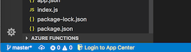
    * Login to Visual Studio Team Services using the status bar icon.

        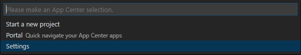

        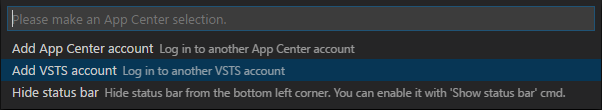

        If you don't already have a personal access token to access your VSTS account you can go [here](https://docs.microsoft.com/en-us/vsts/accounts/use-personal-access-tokens-to-authenticate?view=vsts) to learn how to create one.

    * After logging in, click the App Center status bar to show possible menu options and choose `Start a new project`.

        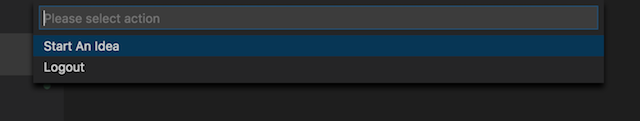
    * You will be prompted to enter a new name for your project and select user or organization where you would like to create app in App Center.

        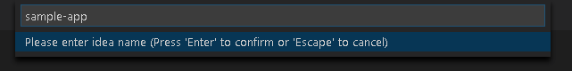
        * App Center sample app will be cloned into the repository you have provided (it will also have preconfigured for App Center Analytics/Crashes/CodePush SDK's)
        * Two React Native apps (for iOS and Android) will be created in App Center (`project-name-ios` and `project-name-android`)
        * CodePush deployments will be created for both apps
        * Apps will be automatically linked with corresponding iOS/Android secret keys and CodePush deployment keys
        * Changes will be pushed to your remote repository
        * New Testers Distribution Group will be created for every new app in App Center
        > Tip: If you enable `appcenter.api.configurebranchandstartnewbuild` in extension sessings, the app will also be connected to your GH repository `master` branch and new build will be started 
        * You will be notified when everything's finished and also we will automatically run `npm install` and `pod update` for you

2. Link an existing React Native application to App Center. 
    You will see a `Set Current App` option, when logged in.

    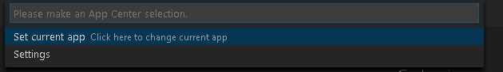

    You can either choose an app from App Center or choose it to be created for you.
    When you pick `Create an App Center app` option, several options are available:
    * Create an app for Android
    * Create an app for iOS
    * Create apps for both platforms

    If you choose one of the first two, the app will be created and automatically set as current. If you choose to create two apps, you will have to pick one of them as current when a prompt is shown.

    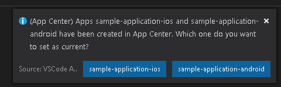

    When the current app is set, several new options appear in the menu:    
    * Test (only for iOS)
    * CodePush

    They all open the corresponding App Center tabs for the application. `CodePush` also contains CodePush stuff.

    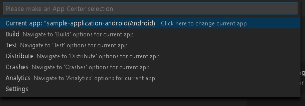

    >Tip: If you enable `appcenter.crashes` setting, you will see `Simulate crashes` menu option under `Crashes`. It sends test crash data to the linked App Center application.

3. Link CodePush module to an existing React Native application.
    When inside of a React Native application, you will see a `Link CodePush` button under `CodePush` menu. Choose it.

    * You will be prompted to choose an Android and iOS app to link.
    * CodePush SDK for React Native will be installed and saved into your `plugin.json`.
    * Deployment keys for the chosen applications will be fetched or created
    * We will run `react-native link react-native-code-push` for you and automatically fill all the prompts, and notify you when finished.

4. Link App Center to an existing React Native application.
    When inside of a React Native application, you will see an `Install SDK` button in menu. Choose it.

    * You will be prompted to choose an Android and iOS app to link.
    * App Center SDK for React Native will be installed and saved into your `plugin.json`.
    * App secrets for the chosen applications will be fetched
    * We will run `react-native link appcenter` for you and show you the secrets to be pasted.
    > Pay attention: Unlike linking CodePush, you will have to paste these secrets in the Terminal yourself when prompted. 

5. You would like to open already existing React Native application with CodePush installed. When logged in, the following App Center Menu options should be avaliable under `CodePush`:
    * Link CodePush
    * Navigate to CodePush tab in App Center
    * Make a new CodePush release
    * Change current Deployment
    * Change target binary verson 
    * Change if release should be mandatory

    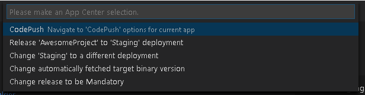

## Test

If your React Native application has UI tests, you can run it in the App Center cloud using the extension.

### Preparing tests

In order to run the tests in App Center cloud, you need [App Center CLI](https://github.com/Microsoft/appcenter-cli). To install it, run `npm install -g appcenter-cli` in terminal.

#### iOS
Extension supports XCUI tests only. Please, follow [the instructions for App Center portal docs](https://docs.microsoft.com/en-us/appcenter/test-cloud/preparing-for-upload/xcuitest) to prepare tests for uploading to the App Center cloud. 

#### Android
Extension supports Espresso tests only. Please, follow [the instructions for App Center portal docs](https://docs.microsoft.com/en-us/appcenter/test-cloud/preparing-for-upload/espresso#2-changes-to-the-tests) to prepare tests for uploading to the App Center cloud. You only have to complete steps 1 - 3, we will run all the builds and upload tests to the portal for you. 

### Running tests

1. Open **App Center menu** and then click `Test` button. 

2. To run tests, you can use two options: `Run UI tests` and `Run UI tests asynchronously`. Command `Run UI tests` will start to build your application for testing, upload it together with tests to App Center cloud and then run it there waiting for tests to be done. Command `Run UI tests asynchronously` does the same thing except it exits the command when tests are uploaded, without waiting for test results. Choose the one you prefer the most. Also, you can track progress of command below in status bar.

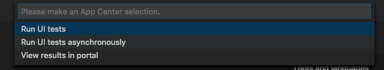

3. Select device configuration for tests. If you have device sets, they will appear at the top of the list and you can choose them.

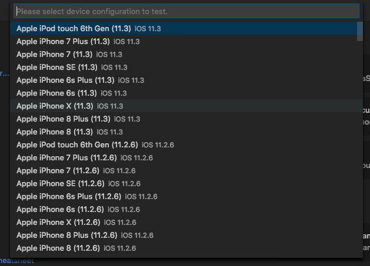

4. After that, `Output > React Native` window will be opened,  where you can monitor the progress of the build, upload and run the tests.

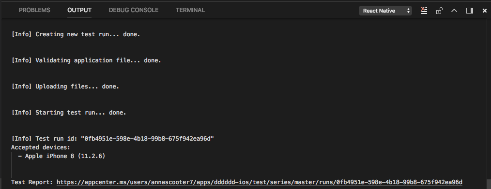

## Contributing
There are a couple of ways you can contribute to this repo:

- **Ideas, feature requests and bugs**: We are open to all ideas and we want to get rid of bugs! Use the Issues section to either report a new issue, provide your ideas or contribute to existing threads.
- **Documentation**: Found a typo or strangely worded sentences? Submit a PR!
- **Code**: Contribute bug fixes, features or design changes.

## Troubleshooting

Here is the list of common known issues you may experience while using the extension:

| Issue         | Description |
| ------------- |-------------|
| You received error '`failed to push to remote ... Device not configured`' when starting new project and pushing to remote repo      | Install [Git Credential Manager](https://docs.microsoft.com/en-us/vsts/git/set-up-credential-managers?view=vsts#install-the-git-credential-manager) and try again |
| You received error '`CocoaPods was not able to update the master repo`' when running '`pod repo update`' while linking App Center| Delete and recreate your specs for repo by running `pod repo remove master` and `pod setup` commands
                        

## Legal
Before we can accept your pull request you will need to sign a **Contribution License Agreement**. All you need to do is to submit a pull request, then the PR will get appropriately labelled (e.g. `cla-required`, `cla-norequired`, `cla-signed`, `cla-already-signed`). If you already signed the agreement we will continue with reviewing the PR, otherwise system will tell you how you can sign the CLA. Once you sign the CLA all future PR's will be labeled as `cla-signed`.

## Telemetry reporting
VS Code App Center extension collects usage data and sends it to Microsoft to help improve our products and services. Read our [privacy statement](https://www.visualstudio.com/en-us/dn948229) to learn more.

If you don’t wish to send usage data to Microsoft, edit your workspace settings file `<project-root>/.vscode/settings.json` and add `"appcenter.telemetryEnabled": false`.

## Code of conduct
This project has adopted the [Microsoft Open Source Code of Conduct](https://opensource.microsoft.com/codeofconduct/). For more information see the [Code of Conduct FAQ](https://opensource.microsoft.com/codeofconduct/faq/) or contact [opencode@microsoft.com](mailto:opencode@microsoft.com) with any additional questions or comments.

## License
[MIT](LICENSE)
